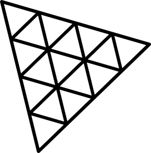

<h1 align="center"><b>three-engine</b></h1>

    

 

<h2>What is <b>three-engine</b>?</h2>
three-engine is game/ engine for three.js.
 
 

## TODO

- [ ] **Thick lines**
- [ ] **Built in shaders**
    - [ ] **Outline shader**
- [ ] **Particles**
- [ ] **Geometry sprites**
- [ ] **Custom geometries**
- [ ] **Physics**
- [ ] **3D models**
- [ ] **3D models animations**
- [ ] **PerspectiveCamera min width**
- [ ] **Custom geometries**
- [ ] **Postprocessing pipeline manager**
- [ ] **Editor(adding, moving and rotating objects with mouse)**
- [ ] **Zoom to cursor in controls**
- [ ] **First person camera**
- [ ] **Third person camera**
- [ ] **Keyboard and mouse controls**
- [ ] **Multiplayer engine**
- [ ] **AI**

 
Creator: <b>Artur Brytkowski</b> 
 

 - <a target="_blank" href="https://www.fiverr.com/arturbrytkowski">Fiverr</a>
 - <a target="_blank" href="https://github.com/allala0">GitHub</a>
 